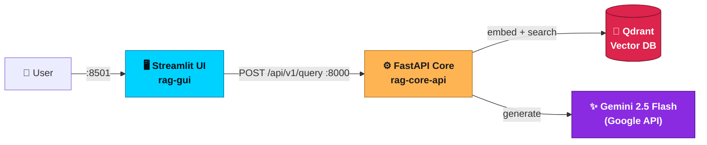
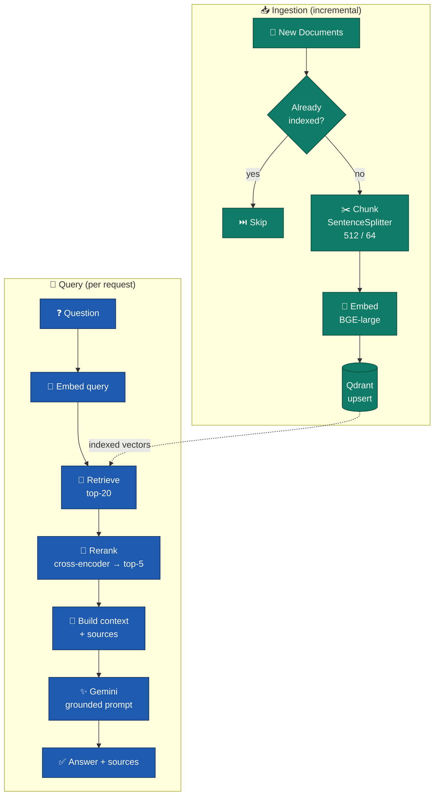
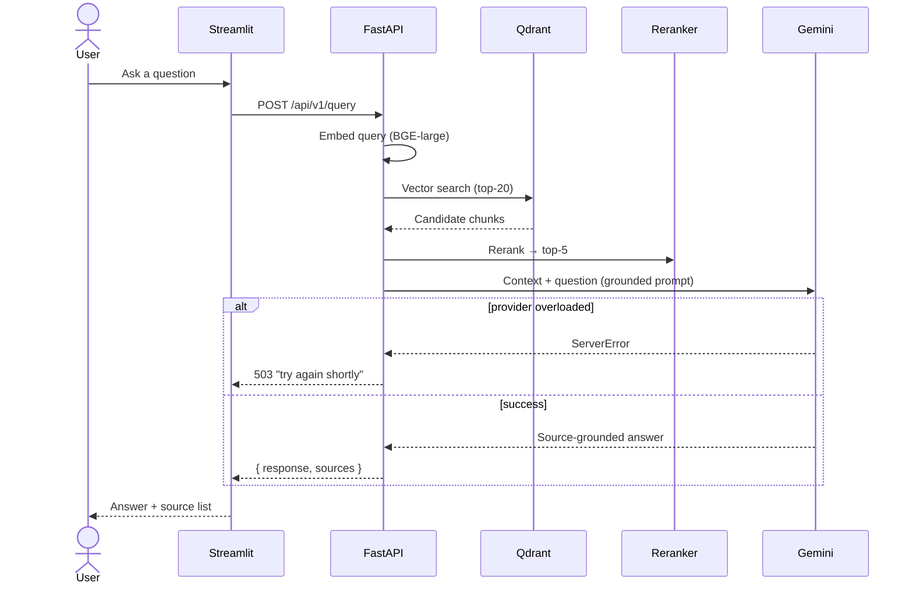

# 🗼 O-RAN Digital Twin — Knowledge Assistant

> A **Retrieval-Augmented Generation (RAG)** assistant for **O-RAN technical documentation**. Ask questions in natural language and get accurate, **source-grounded** answers drawn only from the indexed documents — no hallucination.

<p>


</p>

---

## 📖 Overview

This project indexes a corpus of O-RAN technical documents into a vector database, then answers user questions through a **two-stage retrieval pipeline** (fast dense retrieval + precise cross-encoder reranking), followed by a large language model that is **constrained to answer only from the retrieved context**. The result is a chat assistant that gives traceable, document-backed answers — and explicitly says when the answer isn't in its sources.

It is fully **containerized** with Docker Compose and ships with a clean Streamlit chat UI.

> **Scope:** This is a RAG document-QA system. O-RAN is the *subject domain* of the indexed corpus; the project does not implement O-RAN network functions (RIC, E2/A1/O1, xApps).

---

## ✨ Key Features

- 🔎 **Two-stage retrieval** — dense vector search (recall) + cross-encoder reranking (precision)
- 🧷 **Strict grounding** — answers come only from retrieved sources; refuses out-of-scope questions instead of guessing
- 🧩 **Local embeddings & reranking** — run on your machine; only generation is hosted
- ♻️ **Incremental ingestion** — only *new* documents are embedded; existing ones are skipped automatically
- 🛡️ **Resilient generation** — automatic retries and a graceful `503` when the LLM provider is overloaded
- 🗂️ **Source attribution** — every answer lists the documents it was built from
- 🐳 **One-command deploy** — `docker compose up`

---

## 🏗️ Architecture



---

## 🔁 RAG Pipeline



---

## 🔄 Request Sequence



---

## 🧰 Tech Stack

| Layer | Technology |
|---|---|
| **UI** | Streamlit |
| **API** | FastAPI + Uvicorn |
| **Orchestration** | LlamaIndex Workflows (event-driven) |
| **Embeddings** | `BAAI/bge-large-en-v1.5` (1024-d, local) |
| **Reranker** | `cross-encoder/ms-marco-MiniLM-L-6-v2` (local) |
| **LLM** | Google Gemini 2.5 Flash |
| **Vector DB** | Qdrant (HNSW, cosine) |
| **Packaging** | Docker + Docker Compose |

---

## 🚀 Getting Started

### Prerequisites
- Docker & Docker Compose
- A **Google AI Studio API key** (for Gemini)

### 1. Configure environment
Create a `.env` file in the project root (see `.env.example`):

```env
QDRANT_HOST=qdrant-db
QDRANT_PORT=6333
COLLECTION_NAME=oran_digital_twin

GOOGLE_API_KEY=your_key_here
GEMINI_MODEL=gemini-2.5-flash
```

> ⚠️ **Never commit `.env`.** It is listed in `.gitignore`.

### 2. Add your documents
Place PDFs / Markdown / text files in:
```
data/source_docs/
```

### 3. Launch
```bash
docker compose up -d --build
```

On first boot the documents are embedded (a few minutes). Watch progress:
```bash
docker compose logs -f rag-core-api
```
Wait for `Application startup complete`.

### 4. Open the app
| Service | URL |
|---|---|
| 🖥️ Chat UI | http://localhost:8501 |
| 📚 API docs | http://localhost:8000/docs |

---

## ♻️ Adding More Documents

Ingestion is **incremental**. Drop new files into `data/source_docs/` and restart the API:

```bash
docker compose restart rag-core-api
```

Only the **new** files are embedded — already-indexed documents are detected and skipped.

> To rebuild the index from scratch (e.g. after changing the chunking strategy or embedding model), wipe the vector store first:
> ```bash
> docker compose down -v && docker compose up -d --build
> ```

---

## 🔌 API

**`POST /api/v1/query`**
```json
// request
{ "query": "How does the O-RAN 7.2x functional split balance centralization and distribution?" }
```
```json
// response
{
  "query": "...",
  "response": "Source-grounded answer ...",
  "sources": "[1] paper.pdf\n[2] paper.pdf"
}
```

**`GET /health`** → `{ "status": "healthy" }`

**Error responses**
| Status | Meaning |
|---|---|
| `503` | Pipeline not ready, or the LLM provider is temporarily overloaded — retry shortly |
| `500` | Unexpected internal error |

---

## 📁 Project Structure

```
.
├── api/
│   └── main.py              # FastAPI app + endpoints + error handling
├── config/
│   └── settings.py          # Central configuration (Pydantic)
├── services/
│   ├── ingestion.py         # Incremental chunk → embed → store
│   ├── pipeline.py          # Retrieve → rerank → generate
│   └── prompt_templates.py  # Grounded prompt template
├── gui/
│   └── app.py               # Streamlit chat UI
├── data/source_docs/        # Your documents go here
├── docker/
│   ├── Dockerfile.api
│   └── entrypoint.sh        # Waits for Qdrant, then starts API
├── docker-compose.yml
└── requirements.txt
```

---

## 🧠 How It Works

1. **Ingestion** — new documents are split into ~512-token overlapping chunks, embedded with BGE-large, and stored in Qdrant. Files already present in the index are skipped, so re-runs only process new content.
2. **Retrieval** — the query is embedded and matched against stored vectors to recall the top 20 candidates.
3. **Reranking** — a cross-encoder re-scores each (query, chunk) pair jointly and keeps the 5 most relevant.
4. **Generation** — the selected context is injected into a prompt that instructs Gemini to answer **only** from that context, returning the answer and its sources. Transient provider errors are retried, and persistent overload is surfaced as a clean `503`.

---

## 🗺️ Roadmap

- [ ] Retrieval & faithfulness evaluation (Recall@k, MRR, RAGAS)
- [ ] Relevance-score threshold (skip generation when nothing relevant is retrieved)
- [ ] Page-level / sentence-level source citations
- [ ] Multilingual embeddings (e.g. `BAAI/bge-m3`) for Arabic + English queries
- [ ] GPU / hosted inference for embeddings & reranking
- [ ] Authentication, rate limiting, and CI/CD

---

## 📄 License

Released under the MIT License — see `LICENSE`.

## 🙏 Acknowledgements
Built with [LlamaIndex](https://www.llamaindex.ai/), [Qdrant](https://qdrant.tech/), [FastAPI](https://fastapi.tiangolo.com/), [Streamlit](https://streamlit.io/), and Google Gemini.